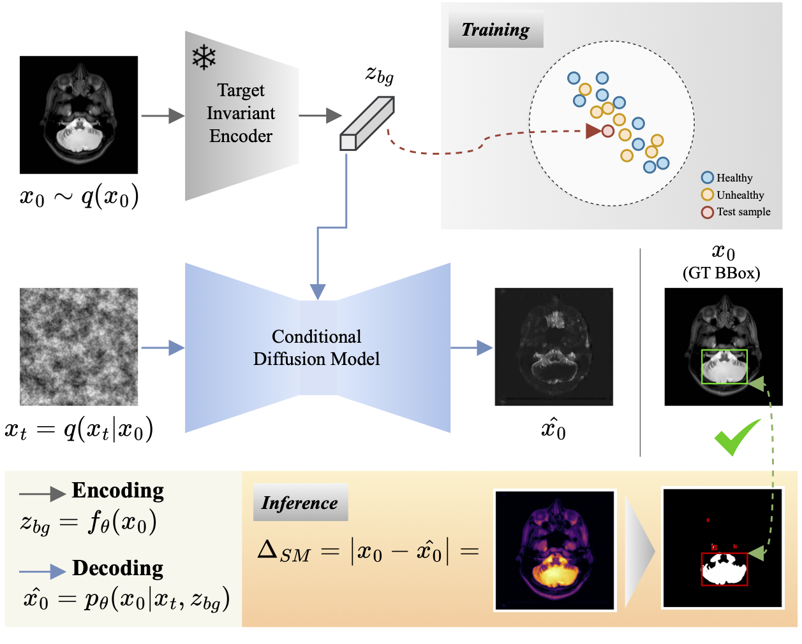

# Unsupervised contrastive analysis for anomaly detection in brain MRIs via conditional diffusion models

Official implementation of the paper [Unsupervised contrastive analysis for anomaly detection in brain MRIs via conditional diffusion models](https://arxiv.org/abs/2406.00772).

## Abstract
Contrastive Analysis (CA) detects anomalies by contrasting patterns unique to a target group (e.g., unhealthy subjects) from those in a background group (e.g., healthy subjects). In the context of brain MRIs, existing CA approaches rely on supervised contrastive learning or variational autoencoders (VAEs) using both healthy and unhealthy data, but such reliance on target samples is challenging in clinical settings. Unsupervised Anomaly Detection (UAD) offers an alternative by learning a reference representation of healthy anatomy without the need for target samples. Deviations from this reference distribution can indicate potential anomalies. In this context, diffusion models have been increasingly adopted in UAD due to their superior performance in image generation compared to VAEs. Nonetheless, precisely reconstructing the anatomy of the brain remains a challenge. In this work, we propose an unsupervised framework to improve the reconstruction quality by training a self-supervised contrastive encoder on healthy images to extract meaningful anatomical features. These features are used to condition a diffusion model to reconstruct the healthy appearance of a given image, enabling interpretable anomaly localization via pixel-wise comparison. We validate our approach through a proof-of-concept on a facial image dataset and further demonstrate its effectiveness on four brain MRI datasets, achieving state-of-the-art anomaly localization performance on the NOVA benchmark.

